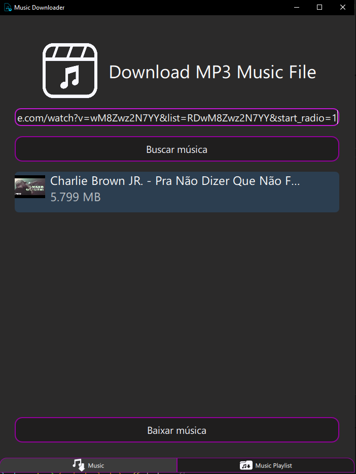

# ⭐ Visão Geral do Projeto

### Este projeto é um downloader de músicas desenvolvido para funcionar com urls de músicas do youtube. O sistema apresenta uma interface simples e intuitiva

<div style="text-align: center;">

</div>

# 🎯 Objetivo
### O objetivo principal deste projeto é aprendizado, principalmente com a construção de GUIs utilizando a linguagem python


# 🛠️ Tecnologias Utilizadas


# 💼 Dependências e explicações do uso
1. ### pyside6: Criação da interface
2. ### pytubefix: Utilizado para acessar e baixar os audios dos videos inseridos via url do youtube

# 📝 Versões das dependências


# 🚀 Execução do projeto
```bash
git clone https://github.com/GustavoProcopio27/Music_Downloader.git
cd music_downloader

# Utilizando pip e python
pip install -r requirements.txt
python main.py

# Utilizando uv
uv run main.py

```

# 🌳 Árvore do projeto 

```
music_downloader
├─ ui
│  ├─ images/ 
│  ├─ main.qml
│  ├─ MusicPage.qml
│  ├─ PlaylistPage.qml
│  └─ Toast.qml
│
├─ downloader
│  └─ core.py
│
├─ interface
│  └─ communication.py
│
├─ schemas
│  ├─ video_data.py
│  └─ video_model.py
│
├─ main.py
├─ README.md
├─ pyproject.toml
├─ ruff.toml
├─ .python-version
├─ requirements.txt
└─ uv.lock

```